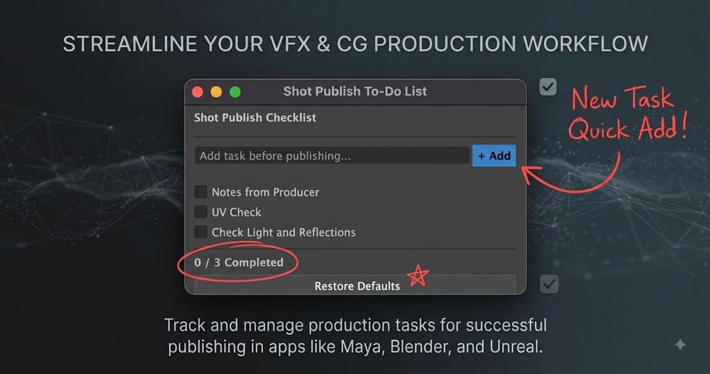

# Maya Pre-Publish Shot To-Do List

A lightweight, native Maya pre-publish checklist utility designed for 3D Artists, Lighting TDs, Animators, and Compositors to perform essential scene sanity checks before publishing shots to production management tools (e.g., ShotGrid/F秩序).

Developed by **Rahul Gambhir** ([@thecodemaster21](https://github.com/thecodemaster21)).

---

## Preview

<p align="center">
  
</p>

---

## Key Features

- **Always-on-Top Floating Window:** Stays anchored on top of the Maya application window so it never drops behind the main interface when clicking into the viewport or graph editor.
- **Pure Maya Commands (`maya.cmds`):** Built entirely with native Maya UI controls—zero external Qt/PySide framework dependencies for maximum cross-version compatibility.
- **Scene-Persistent Storage:** Checklist tasks and check-states embed directly inside the active Maya scene file (`.ma` / `.mb`) using an internal `scriptNode`. The checklist travels seamlessly across workstation handoffs.
- **Auto-Fitting Dynamic Height:** Automatically adjusts window height based on active items—no inner scrollbars or wasted empty UI padding.
- **Dynamic Task Creation:** Add custom task reminders on the fly during active scene assembly or lighting passes.
- **Restore Pipeline Defaults:** Quickly reset to studio standard sanity checks with a single click.

---

## Installation & Setup

1. Clone or download this repository.
2. Place `maya_shot_todolist.py` inside your local Maya scripts directory:
   - **Windows:** `C:\Users\<Username>\Documents\maya\scripts\`
   - **macOS:** `/Users/<Username>/Library/Preferences/Autodesk/maya/scripts/`
   - **Linux:** `~/maya/scripts/`

3. Open Autodesk Maya and launch the **Script Editor** (Python tab).
4. Run the following command:

```python
import maya_shot_todolist
maya_shot_todolist.show_ui()